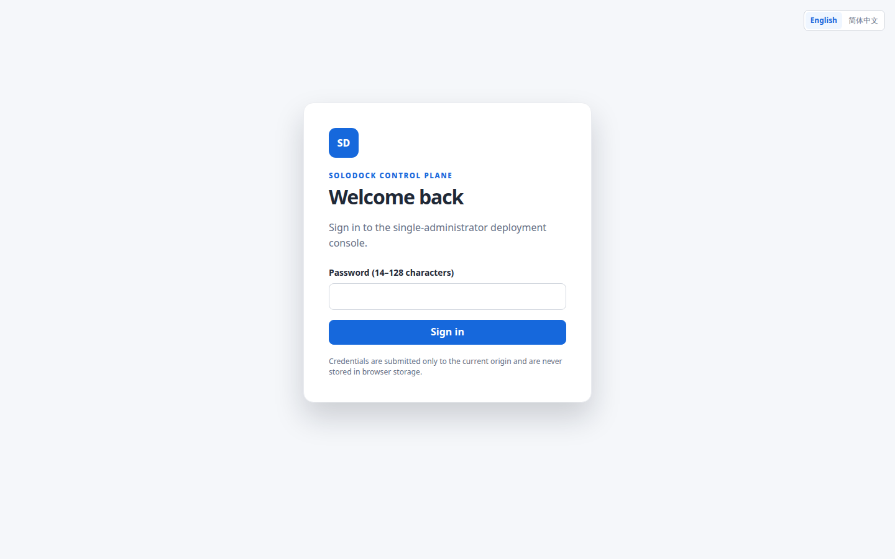

# SoloDock

**A focused deployment console for running prebuilt OCI images safely on one personal Docker host.**

[简体中文](README.zh-CN.md) · [Documentation](docs/product-scope.md) · [Contributing](CONTRIBUTING.md) · [Security](SECURITY.md)

> [!WARNING]
> SoloDock is a `0.x`, single-host project. Docker socket access is effectively host root access. Before deployment, provide independent business-data backups and harden the external access path.

SoloDock turns an image tag into a digest-pinned release, applies a generated one-service Compose configuration, waits for the selected health policy, and commits the release only after verification. If a candidate fails deterministically, it removes that candidate or restores and verifies the previous release. Manual rollback uses the same guarded deployment path.

SoloDock does not build source code, accept arbitrary Compose, manage domains/TLS, provide a reverse proxy, or orchestrate multiple hosts. It is intentionally smaller than a general Docker manager or self-hosting PaaS.

The Web UI supports English and Simplified Chinese before and after sign-in. On a first visit it selects Simplified Chinese only when the browser's first preferred language is `zh` or `zh-*`; otherwise it uses English. An explicit choice is remembered only in that browser.



## Deployment path

```text
GitHub Actions or another builder
        │ pushes a prebuilt image
        ▼
OCI Registry
        │ tag resolves to a platform-specific digest
        ▼
SoloDock
        │ generated Compose + health gate + recovery
        ▼
one Docker host
```

## Why SoloDock

- **Digest-pinned releases:** tags are discovery inputs; deployed releases and generated Compose use immutable manifest digests.
- **Health-gated commit:** a candidate becomes `active` only after its configured `healthy`, `running`, `completed`, or explicitly reduced-safety `disabled` policy passes.
- **Failure recovery:** deterministic candidate failures trigger exact cleanup or reapplication and fresh verification of the previous release. Unknown effects preserve the scene as `interrupted` or `needs_attention` instead of guessing.
- **Manual rollback:** rollback recreates an earlier immutable image/configuration release through the same identity, resource, and health checks.
- **Conservative ownership:** Docker effects require exact project, service, application, release, schema, and full container identity. Volumes, bind data, and networks are preserved.

Rollback restores the release image and generated configuration only. It does not roll back database migrations, named volumes, or bind contents, and SoloDock does not provide zero-downtime switching.

## Who it is for

SoloDock may fit when you:

- run personal services on one Ubuntu server with one administrator;
- already build images in CI and push them to an OCI Registry;
- want a narrow Web workflow for configuration, deployment, health verification, automatic digest polling, recovery, and rollback;
- already operate an HTTPS tunnel or reverse proxy and maintain workload-specific backups;
- prefer typed fields and generated Compose over arbitrary YAML.

It is not intended when you need:

- source builds, buildpacks, or Git-based application builds;
- arbitrary Compose stacks, multiple services per application, replicas, or adoption of existing projects;
- built-in proxy, DNS, certificates, firewall management, or zero-downtime routing;
- multiple hosts, Kubernetes/Swarm, high availability, teams, multi-tenancy, or RBAC;
- browser shell/exec, privileged containers, arbitrary host binds, or automatic data migration/backup.

See the complete [product scope](docs/product-scope.md).

## Project boundaries at a glance

These projects solve adjacent problems with different operating models. This is a scope comparison, not a claim that one project is universally better.

| Project | Primary model | Where it differs from SoloDock |
| --- | --- | --- |
| SoloDock | One typed, prebuilt-image service per application on one host | Digest-pinned releases, health-gated commit, guarded failure recovery; no arbitrary Compose, build, proxy, or multi-host control |
| [Dockge](https://github.com/louislam/dockge) | Compose stack management | Centered on editing and operating Compose stacks rather than SoloDock's generated single-service release model |
| [Watchtower](https://github.com/containrrr/watchtower) | Automated updates for running containers | Focused on image-update automation rather than an application configuration console with immutable release history and manual rollback |
| [Coolify](https://github.com/coollabsio/coolify) | A broader self-hosting platform | Includes a wider application/platform workflow; SoloDock deliberately excludes source builds, integrated proxy/TLS, and multi-server orchestration |

## Install a stable release

Published Releases provide a long-lived, attested package for Ubuntu 24.04 x86_64. The production host also needs a currently supported Docker Engine release no older than 28.3.3, the `docker` group/socket, systemd, Docker Compose v2.24+, and an authenticated GitHub CLI with the `gh attestation verify` capability. Distribution packages can lag behind GitHub CLI capabilities, so install or upgrade `gh` with GitHub's [official Linux instructions](https://github.com/cli/cli/blob/trunk/docs/install_linux.md), then run `gh attestation verify --help` and `gh auth login --hostname github.com` before installation or update. No Rust or Node.js toolchain is required. The complete host-network verification and installation commands are in [operations](docs/operations.md).

The versioned archive contains the embedded SoloDock binary, installer, updater, backup/restore helpers, package verifier and install manifest, systemd unit, configuration example, checksums, source identity, and operator documentation. Verify the Release `SHA256SUMS` attestation and checksums before running the packaged installer.

The installer creates a dedicated `solodock` system account, installs the binary, updater, backup/restore helpers, manifest, and systemd unit as one identity-qualified generation, and preserves existing configuration and state. Official packages require `/etc/solodock/config.toml`, `/var/lib/solodock`, and `/run/solodock`; a custom loopback listen port remains supported and is read by the updater from the verified configuration. It does not start the service by default.

Before startup:

1. Edit `/etc/solodock/config.toml`. Keep `listen_address` on loopback and set `public_origin` to the exact externally served HTTPS origin.
2. Configure that external tunnel or reverse proxy with TLS, pre-authentication access control, and rate limiting.
3. Establish independent backups for every workload volume, bind, and database.
4. Start the service, then read the one-time bootstrap token without copying it into logs:

```bash
sudo systemctl enable --now solodock.service
sudo systemctl status solodock.service
sudo cat /run/solodock/bootstrap.token
```

Open the configured `public_origin`, complete bootstrap, and then create an application. For exact upgrade, backup, authentication, and troubleshooting requirements, read [operations](docs/operations.md) and [recovery](docs/recovery.md). `solodock-update` follows the current installation source: Release installations stay on `stable`, while maintainer installations from CI stay on `main`. Use `--channel stable|main` once only when intentionally switching tracks.

## Security prerequisites

- `/var/run/docker.sock` and `docker` group membership are effectively host root, not a low-privilege boundary.
- SoloDock and published application ports accept loopback listeners only. Public access requires an external HTTPS tunnel or reverse proxy and access controls.
- SoloDock preserves volumes and bind contents, but it does not back them up or undo data migrations during rollback.
- Registry tokens and webhook secrets are write-only and excluded from ordinary APIs, Compose, logs, and audit, but offline control-plane backups contain secrets and require high-sensitivity handling.
- SoloDock verifies Registry digest and platform identity but does not currently verify Cosign/Sigstore image signatures.

Read the [threat model](docs/threat-model.md) before production use. Report vulnerabilities through [private vulnerability reporting](SECURITY.md), never a public Issue.

## Documentation

- Product and configuration: [product scope](docs/product-scope.md), [application model](docs/application-model.md)
- System and release semantics: [architecture](docs/architecture.md), [deployments and rollback](docs/deployments.md), [API and streams](docs/api-and-streams.md)
- Production operation: [operations](docs/operations.md), [recovery](docs/recovery.md), [threat model](docs/threat-model.md), [resource budget](docs/resource-budget.md)
- Focused protocols and acceptance: [webhooks](docs/webhooks.md), [testing and safety guardrails](docs/testing.md)

The topic documents describe current implemented behavior. Git history preserves completed designs and delivery plans; they are not sources of truth for current behavior.

## Contributing and license

Read [CONTRIBUTING.md](CONTRIBUTING.md) before proposing changes. SoloDock uses the [Apache License 2.0](LICENSE).
